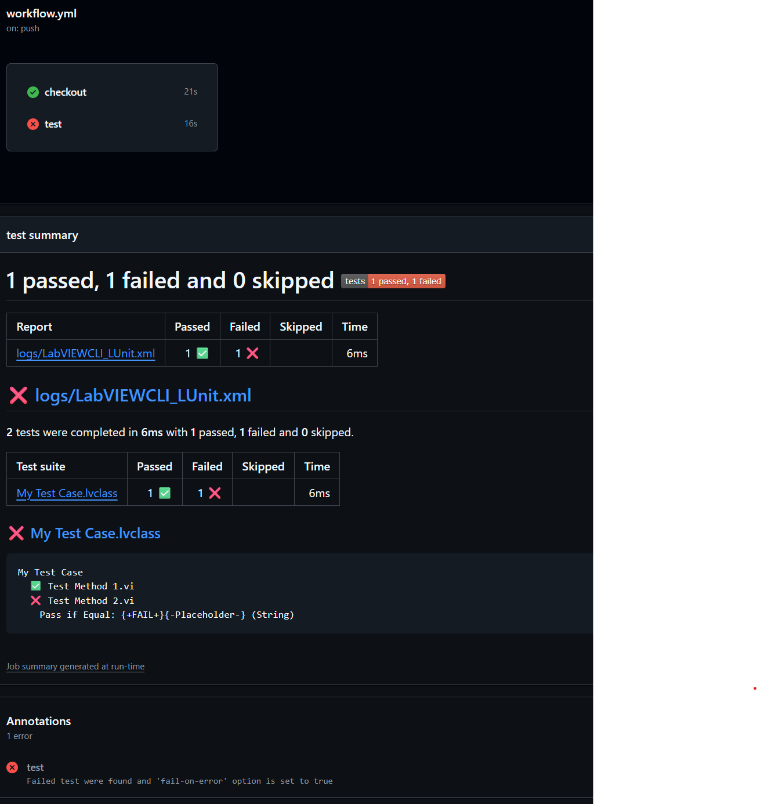

# CI Integration

LUnit was designed to easily and natively integrate into continuous integration (CI) pipelines.
To achieve this, a way of executing tests from the command line is needed and the results need to be available in a format that can be digested by the CI system.

## Executing Tests from the Command Line

The command line interface (CLI) has been migrated out of the main LUnit project.
The reason for this is that the CLI is installed on the system level and requires installation as an administrator.
To install the native CLI, please use [this package](https://www.vipm.io/package/astemes_lib_lunit_cli/).
There is also a G-CLI package, maintained by Sam at SAS Workshops, which can be found [here](https://www.vipm.io/package/sas_workshops_lib_lunit_for_g_cli/) (please note that this document does not apply to the G-CLI).

LUnit installs a command line operation using the LabVIEW native [LabVIEWCLI by NI](https://zone.ni.com/reference/en-XX/help/371361R-01/lvhowto/cli_running_operations/).
This operation is named LUnit and may be called using `LabVIEWCLI -OperationName LUnit`.
An example illustrating the usage of the CLI is provided at `...\LabVIEW 20XX\examples\Astemes\LUnit\LUnit CLI Demo.vi`.
A path to load tests from is provided using the `-ProjectPath` argument and the report directory is specified using the `-ReportPath` argument.

When executing tests from the command line, the test case index is cleared and re-created by default each time.
This ensures that all inherited test methods are detected, at the expense of some overhead for test discovery.
The `-ClearIndex` flag may be used to override this behavior and re-use the index to improve the execution time.

The test finder maintains an index of all test methods for all test classes in the project.
When the test finder starts, it loads the index and compares it against all classes, re-indexing any that have changed.
However, as of version 1.0, the test indexer does not re-index a class when a parent class has added a new dynamic test method.
Clearing the index ensures these newly inherited methods are detected.

|Argument|Description|
|---|---|
|<nobr>`-Path or -ProjectPath`</nobr>|The project containing the tests to be executed. The interface also accepts libraries or test case classes of types .lvlib or .lvclass. If you provide a directory, all tests within this directory or sub directories will be executed.|
|<nobr>`-TestRunners`</nobr>|Specifies the number of parallel test runners to spawn. Default value is 1.|
|<nobr>`-ReportPath`</nobr>|The output path for the report file generated. The execution generates either a .txt-file or an .xml-file, based on the path specified.|
|<nobr>`-ClearIndex`</nobr>|Clear the index and force LUnit to rediscover all tests. Default is ``True``. The index must be cleared to find new tests inherited by a Test Case.|

The LabVIEW CLI uses VI Server and by default it is configured to work on port 3363.
You will need to make sure that the connection is not blocked by firewalls.

## Capturing the Test Results

Test results are saved in a text-based format at the location specified when executing the command line operation.

LUnit has a built-in XML format for test reports that uses the same structure as the [JUnit XML specification](https://llg.cubic.org/docs/junit/).
To use the JUnit XML format, you must provide a file path with the `.xml` extension.
Once the tests have finished, the result file is available at the specified path and can be digested by most CI tools.
For Jenkins this is done using the [JUnit plugin](https://plugins.jenkins.io/junit/).

## GitHub Actions Example

GitHub provides the GitHub Actions CI toolchain, which is very similar to other vendor alternatives such as GitLab or Azure DevOps.
To run your CI pipeline using one of these tools, you would typically set up your own self-hosted runner, where you would install LabVIEW, LUnit, and LUnit CLI.
A minimal example workflow for running tests and reporting results back to GitHub would look like below, using the dorny/test-reporter action.

```yml
name: 'LUnit Test'
description: 'Runs all LUnit tests under the tests directory using LUnit CLI'

jobs:
  steps:
      - name: Run LUnit tests
      - run: |
          LabVIEWCLI `
            -OperationName LUnit `
            -ProjectPath $env:GITHUB_WORKSPACE\tests `
            -ReportPath $env:GITHUB_WORKSPACE\LabVIEWCLI_LUnit.xml `
        shell: powershell
      - name: Publish Test Report
        uses: dorny/test-reporter@v2
        if: ${{ !cancelled() }}
        with:
          name: LUnit Tests
          path: LabVIEWCLI_LUnit.xml
          reporter: java-junit
```

When this runs, it will execute the test suite and report results back to GitHub, with results as shown below.



## Jenkins Example

Jenkins is a popular open source automation server used for continuous integration and delivery pipelines.
A pipeline in Jenkins may be configured using a declarative Jenkinsfile which may be saved directly in the repository.
Below is an example showing a basic configuration.

```groovy
pipeline {
	agent any
	environment{
		LV_PROJECT_PATH = "Path to Your LabVIEW Project.lvproj"
        NUM_TEST_RUNNERS = "1"
        LV_PORT = "3363"
	}
	stages {
		stage('Unit Tests') {
			steps {
				bat "LabVIEWCLI -OperationName LUnit -ProjectPath \"${WORKSPACE}\\${LV_PROJECT_PATH}\" -TestRunners ${NUM_TEST_RUNNERS} -ReportPath \"${WORKSPACE}\\lunit_reports\\lunit.xml\" -ClearIndex TRUE -PortNumber ${LV_PORT} -LogFilePath \"${WORKSPACE}\\LabVIEWCLI_LUnit.txt\" -LogToConsole true -Verbosity Default"

				junit "lunit_reports\\*.xml"
			}
		}
	}
}
```

The pipeline above declares three environment variables used to configure the call to LUnit using the LabVIEW CLI.
The first is the path to the project file relative to the workspace, *i.e.* the path relative to the root of the repository where the Jenkinsfile is located.
The second is the number of parallel test runners to spawn, here configured to one.
The third parameter is the port configured for VI Server in LabVIEW under Tools > Options > VI Server.

The report is saved in the path `lunit_reports` using the file name `lunit.xml`.
After tests are executed using the bat command, the JUnit plugin is called to digest the report files generated.
This requires that the Jenkins JUnit plugin is installed, which is the case with the recommended default settings when installing Jenkins.

Note that this is a minimal example meant to demonstrate the concept.
It could be improved significantly to reduce the details in the Jenkinsfile using shared libraries.
As an example, the build system used to build LUnit uses a simpler command `runLUnit "${LV_PROJECT_PATH}"` in the Jenkinsfile instead of the rather detailed `bat` command.
